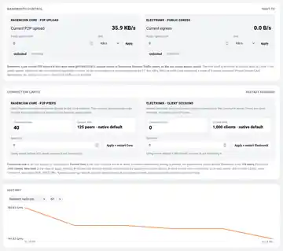
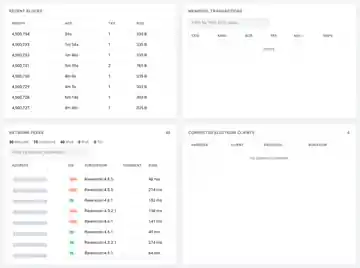
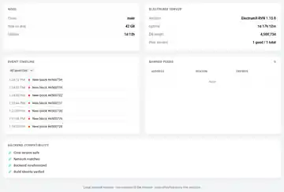

# Ravencoin Node Monitor

A lightweight, self-hosted dashboard for **Ravencoin Core**, with optional **ElectrumX** monitoring and optional host-side controls for upload bandwidth and connection limits.

It is designed for the machine that actually runs your node: Raspberry Pi, Orange Pi, mini PC, home server, VPS, or any Linux host where Docker is available.

> **The short version:** point the monitor at your Ravencoin Core RPC, open the dashboard in your browser, and you get node health, sync state, peers, mempool, storage, host resources, P2P traffic, ElectrumX status, history and diagnostics in one place. If you install the optional host controller, you can also change upload caps and peer/client limits from the dashboard without editing Ravencoin Core or ElectrumX source code.

## Live public demo

A public demonstration is available at:

**https://ravencoin-node-monitor.vercel.app/**

The public demo is deliberately separated from any private node. It uses public market/mainnet data where possible and clearly labels local-only values as simulated or unavailable. See [`DEMO.md`](DEMO.md) for the exact security boundary.

## What it looks like

### Node health, sync, resources and Ravencoin P2P traffic


### Live bandwidth controls, connection limits and history



### Recent blocks, mempool, peers and ElectrumX clients

Peer addresses in this README screenshot are deliberately redacted.



### Node, ElectrumX, events and backend compatibility



---

## What this monitor actually does

The monitor reads information from your own Ravencoin Core node and, when configured, your own ElectrumX server. It does **not** replace either service and it does not participate in consensus.

The dashboard can show:

- Ravencoin Core version, chain, block height, headers and synchronization progress;
- RPC latency and a deterministic node-health score;
- connected P2P peers, inbound/outbound counts, IPv4/IPv6/Tor counts, peer subversions and ping times;
- network difficulty and hashrate;
- mempool count, size, minimum fee and transaction details;
- recent blocks and transaction IDs;
- host CPU load, temperature, RAM, swap and disk use;
- extra mounted disks, useful when the blockchain lives on a separate SSD/NVMe;
- Ravencoin P2P upload/download rate and cumulative traffic from Core's `getnettotals` RPC;
- in-memory historical charts and storage-growth estimates;
- event timeline for new blocks, outages, recoveries, reorgs, low peers, disk warnings and similar state changes;
- optional RVN/USDT market price;
- ElectrumX version, uptime, database height, peer-server state and connected Electrum clients;
- backend compatibility checks;
- Prometheus-compatible metrics, health/readiness probes and a sanitized diagnostics endpoint.

With the **optional host controller**, the same dashboard can also:

- set a public upload cap for Ravencoin Core;
- set a public upload cap for ElectrumX;
- set Ravencoin Core's maximum P2P peers using native `-maxconnections=N`;
- set ElectrumX's maximum client sessions using native `MAX_SESSIONS=N`.

The monitor does not patch Ravencoin Core or ElectrumX source code to do this.

---

# Quick start

This section is intentionally written for someone who has never installed this project before.

## Before you start

You need:

1. a running Ravencoin Core node;
2. Core RPC enabled (`server=1` in `raven.conf`);
3. Docker with Docker Compose;
4. the RPC username/password used by your node;
5. optionally, a running ElectrumX server.

If you only run Ravencoin Core, that is fine: the ElectrumX cards simply remain hidden when `ELECTRUMX_ENABLED=auto`.

## 1. Install Docker

On Debian, Ubuntu or Raspberry Pi OS:

```bash
curl -fsSL https://get.docker.com | sh
sudo usermod -aG docker "$USER"
```

Then log out and back in, or run:

```bash
newgrp docker
```

Check that Compose works:

```bash
docker compose version
```

## 2. Clone the monitor

```bash
git clone https://github.com/ALENOC/ravencoin-node-monitor.git
cd ravencoin-node-monitor
```

## 3. Create your configuration

```bash
cp .env.example .env
nano .env
```

At minimum, set the Ravencoin Core RPC connection:

```ini
CORE_RPC_HOST=YOUR_CORE_HOST
CORE_RPC_PORT=8766
CORE_RPC_USER=YOUR_RPC_USER
CORE_RPC_PASSWORD=YOUR_RPC_PASSWORD
```

### What should `CORE_RPC_HOST` be?

This is the part that causes the most installation mistakes.

- If Core runs **in another Docker container on the same Docker network**, use that Compose service/container hostname.
- If Core runs **directly on the Linux host**, the monitor container usually cannot use `127.0.0.1` to reach it. Use an address reachable from the container and configure Core's `rpcbind`/`rpcallowip` appropriately.
- If Core runs **on another machine**, use that machine's LAN IP or hostname.

Inside a Docker container, `127.0.0.1` means **that container itself**, not automatically the Raspberry Pi or server underneath it.

### Core RPC example

A simple `raven.conf` can contain something equivalent to:

```ini
server=1
rpcuser=monitor_rpc
rpcpassword=USE_A_LONG_RANDOM_PASSWORD
```

If RPC is reached from another container/address, configure `rpcbind` and `rpcallowip` narrowly for your network instead of exposing RPC to the internet.

If you use Core's `rpcauth=` mechanism, use the original plaintext password associated with that generated credential; the hash stored in `raven.conf` is not itself the password the monitor sends.

## 4. Protect the dashboard

The monitor supports optional HTTP Basic authentication. It is **required for write-capable dashboard controls**.

In `.env`:

```ini
MONITOR_USER=monitor
MONITOR_PASSWORD=CHOOSE_YOUR_OWN_STRONG_PASSWORD
```

Do not commit your real `.env` file.

If you browse using a DNS hostname instead of a private IP/localhost name, also add it to `MONITOR_ALLOWED_HOSTS`, for example:

```ini
MONITOR_ALLOWED_HOSTS=node.local
```

## 5. Start the monitor

```bash
docker compose up -d --build
```

Check it:

```bash
docker compose ps
curl -s http://127.0.0.1:8899/healthz
```

A healthy monitor returns:

```json
{"status":"ok"}
```

That proves the monitor process is alive. The dashboard itself will tell you whether Core/ElectrumX are reachable and synchronized.

## 6. Open the dashboard

The default Compose file binds the web service to:

```text
127.0.0.1:8899
```

That is intentionally conservative. Access it through a local browser, SSH tunnel, LAN-specific override, or your own authenticated reverse proxy/firewall setup.

**Do not expose the dashboard or, especially, Ravencoin RPC directly to the public internet.**

---

# Reading the dashboard

## Health score

The large score at the top is calculated server-side from actual node state. It is not a decorative percentage.

It considers chain freshness/sync, RPC reachability and latency, peers, storage state, mempool availability and ElectrumX lag when ElectrumX is enabled.

`100 HEALTHY` therefore means the configured checks are currently passing; it does not mean the software makes a security guarantee about the entire Ravencoin network.

## RVN / USDT

Optional market information from a public Binance market-data endpoint. Enable it with:

```ini
PRICE_FEED_ENABLED=true
```

The node monitor does not need price data to function.

## Sync

Shows Core's validated block height, headers and verification progress.

A freshly installed node may have many headers while validated blocks are still catching up. That is normal during initial blockchain synchronization.

## P2P Network

Shows Ravencoin network information from Core, including connected peers, protocol version, difficulty and network hashrate.

## Mempool

Shows transactions currently waiting in your Core mempool. This is **your node's mempool view**, not a guarantee that every node on the network has exactly the same list at that instant.

## Host Resources / Storage

Reads Linux host/container-visible resource information. Extra blockchain disks can be added with `EXTRA_DISK_PATHS` and mounted read-only into the monitor container.

The default history configuration is RAM-only specifically to avoid continuous writes to microSD/SSD storage.

---

# Ravencoin Network Traffic

The **Ravencoin Network Traffic** card is P2P-only traffic reported by Ravencoin Core's own:

```text
getnettotals
```

It shows:

- current download rate;
- current upload rate;
- bytes received since Core started;
- bytes sent since Core started;
- total exchanged;
- sampling window;
- Core's native upload-target state, if configured.

This excludes unrelated host traffic such as SSH, Docker updates and the dashboard itself.

The `Current P2P upload` value shown in the Core bandwidth-control card uses the **same `getnettotals` sample**, so those two displayed values are intentionally aligned.

---

# Bandwidth Control

Bandwidth Control is optional. It is implemented by a small root-owned helper on the Docker host using Linux `tc`.

The dashboard container itself remains unprivileged: it does **not** receive the Docker socket and does **not** receive `CAP_NET_ADMIN`.

## Units

You can type a value manually and choose:

```text
B/s
KB/s
MB/s
GB/s
```

`KB`, `MB` and `GB` use 1024-based units in this project.

Examples:

```text
250 KB/s
1.5 MB/s
10 MB/s
```

A value of `0`, or the **Unlimited** button, means no monitor-imposed cap.

### Core versus ElectrumX measurement

For Ravencoin Core, the displayed current rate is Core P2P traffic from `getnettotals`.

For ElectrumX, there is no equivalent application-level `getnettotals` counter, so its current public egress is measured by Linux `tc`.

The actual limit for both services is enforced at network level by `tc`.

Private Docker/LAN destinations are exempted by the controller so normal Core ↔ ElectrumX local traffic is not intentionally throttled.

Full technical documentation: [`BANDWIDTH_CONTROL.md`](BANDWIDTH_CONTROL.md).

---

# Connection Limits

The dashboard separates two completely different concepts.

## Ravencoin Core · P2P peers

These are other **Ravencoin nodes** directly connected to your Core node.

The native setting is:

```text
-maxconnections=N
```

When no explicit override is present, Ravencoin Core's native default is **125 peers**.

## ElectrumX · client sessions

These are **wallets/Electrum-protocol clients** connected to your ElectrumX server. They are not Ravencoin P2P peers.

The native setting is:

```text
MAX_SESSIONS=N
```

ElectrumX's native default is **1000 sessions**, subject to ElectrumX's own file-descriptor safety logic.

## What the fields mean

`Connected now` is how many connections exist right now.

`Current limit` is the current configured/native maximum shown by the monitor.

`New limit` is what you want to apply.

**Entering `0` does not mean zero connections.** It removes the monitor's override and returns the selected service to its deployment/native configuration.

Changing a connection limit requires restarting/recreating **only the selected service**, because Core and ElectrumX read these native settings at process startup. The dashboard asks for confirmation before doing it.

Full technical documentation: [`CONNECTION_CONTROL.md`](CONNECTION_CONTROL.md).

---

# Installing the optional host controller

You only need this section if you want Bandwidth Control and Connection Limits to be writable from the dashboard.

## 1. Install host prerequisites

Debian/Ubuntu/Raspberry Pi OS:

```bash
sudo apt-get update
sudo apt-get install -y python3 iproute2 util-linux
```

## 2. Install the controller service

Example when this repository lives at `/opt/ravencoin-node-monitor`:

```bash
cd /opt/ravencoin-node-monitor
sudo cp contrib/ravencoin-bandwidth-controller.service.example \
  /etc/systemd/system/ravencoin-bandwidth-controller.service
sudo systemctl daemon-reload
sudo systemctl enable --now ravencoin-bandwidth-controller.service
sudo systemctl status --no-pager ravencoin-bandwidth-controller.service
```

The example unit contains default Core/ElectrumX container names. If your deployment uses different names, edit the corresponding `Environment=` values in the systemd unit.

The controller persists its state under:

```text
/var/lib/ravencoin-bandwidth/
```

and exposes a restricted Unix socket under:

```text
/run/ravencoin-bandwidth/control.sock
```

## 3. Enable the dashboard side

In `.env`:

```ini
MONITOR_USER=monitor
MONITOR_PASSWORD=YOUR_STRONG_PASSWORD
BANDWIDTH_CONTROL_ENABLED=true
BANDWIDTH_CONTROL_SOCKET=/run/ravencoin-bandwidth/control.sock
```

Then include the optional Compose overlay:

```bash
docker compose \
  -f docker-compose.yml \
  -f docker-compose.override.yml \
  -f docker-compose.bandwidth.yml \
  up -d --build --no-deps monitor
```

If you want that overlay selected automatically, Compose supports setting `COMPOSE_FILE` in your local `.env`, for example:

```ini
COMPOSE_FILE=docker-compose.yml:docker-compose.override.yml:docker-compose.bandwidth.yml
```

Do not copy a sample override blindly over an existing local override. Preserve your own volumes, networks, LAN binding, secrets and user/group settings.

## 4. Verify the socket is visible

Host:

```bash
sudo ls -l /run/ravencoin-bandwidth/control.sock
```

Monitor container:

```bash
docker exec ravencoin-node-monitor \
  ls -l /run/ravencoin-bandwidth/control.sock
```

If the host socket exists but the container path is empty after the controller service was recreated, recreate only the monitor container so the bind mount attaches to the current runtime directory:

```bash
docker compose up -d --no-deps --force-recreate monitor
```

Do not restart Core or ElectrumX just to refresh this socket mount.

---

# ElectrumX integration

Set:

```ini
ELECTRUMX_ENABLED=auto
```

for the easiest setup. The monitor probes ElectrumX and hides ElectrumX-specific cards when it is not available.

Useful settings include:

```ini
ELECTRUMX_RPC_HOST=127.0.0.1
ELECTRUMX_RPC_PORT=8000
ELECTRUMX_SSL_HOST=127.0.0.1
ELECTRUMX_SSL_PORT=50002
```

Many ElectrumX deployments intentionally bind the admin RPC only to loopback inside their own container. In that case, the recommended integration is the included host-side poller:

```bash
python3 contrib/electrumx-admin-poller.py \
  --container YOUR_ELECTRUMX_CONTAINER \
  --output /var/lib/ravencoin-node-monitor/electrumx-admin.json
```

Then configure:

```ini
ELECTRUMX_ADMIN_SOURCE=file
ELECTRUMX_ADMIN_FILE=/data/electrumx-admin.json
```

and mount that snapshot read-only into the monitor.

This avoids putting the Docker socket into the dashboard container and avoids unnecessarily opening ElectrumX's admin RPC to the LAN.

---

# History: RAM by default

The default is deliberately:

```ini
HISTORY_STORAGE=memory
```

Historical samples live in SQLite `:memory:` and disappear when the monitor restarts.

Why? Because a common target for this project is a Raspberry Pi or similar SBC. Continuously writing time-series data to a microSD card or small SSD forever is unnecessary wear.

History sampling is separate from the live dashboard refresh rate. The default monitor can therefore refresh frequently without writing every refresh to disk.

If you explicitly want persistent local history:

```ini
HISTORY_STORAGE=sqlite
HISTORY_DB_PATH=/data/history.db
```

and mount a writable `/data` volume.

For long-term monitoring without local flash writes, use the `/metrics` endpoint with an external Prometheus-compatible collector.

---

# Privacy

Set:

```ini
PRIVACY_MODE=true
```

and peer/client IP addresses are masked **server-side before being sent to the browser**.

Examples:

```text
192.168.1.123  ->  192.168.x.x
```

The screenshots committed to this README have also been manually redacted where peer addresses were visible.

Do not confuse `PRIVACY_MODE` with access control: masking addresses does not make a public dashboard safe to expose.

---

# Security model

The default container is intentionally restricted:

- read-only root filesystem;
- `cap_drop: ALL`;
- `no-new-privileges`;
- no Docker socket;
- no `CAP_NET_ADMIN`;
- optional Basic authentication;
- Host-header validation to reduce DNS-rebinding exposure;
- security headers and nonce-based CSP;
- RPC credentials can come from mounted files/Docker secrets instead of plain environment values;
- diagnostics are built from an explicit safe-field whitelist;
- remote/FQDN ElectrumX TLS targets require proper certificate verification;
- write actions require authentication and a same-origin control header.

The optional host controller is intentionally separate because Docker service recreation and Linux traffic shaping require host privileges. The web dashboard itself is not granted those privileges.

`/healthz` and `/readyz` intentionally remain available for health probes even when dashboard authentication is enabled.

---

# Useful endpoints

```text
GET /healthz
GET /readyz
GET /metrics
GET /api/status
GET /api/health
GET /api/events
GET /api/history
GET /api/diagnostics
GET /api/bandwidth
GET /api/connections
```

`/api/diagnostics` is specifically designed for bug reports and excludes RPC passwords, webhook URLs and other secrets.

---

# Configuration reference

The complete, authoritative list of environment variables is in [`.env.example`](.env.example).

The settings most people actually need are:

```ini
# Identity / web
NODE_NAME=My Ravencoin Node
BIND_PORT=8899
MONITOR_USER=monitor
MONITOR_PASSWORD=YOUR_PASSWORD

# Core RPC
CORE_RPC_HOST=YOUR_CORE_HOST
CORE_RPC_PORT=8766
CORE_RPC_USER=YOUR_RPC_USER
CORE_RPC_PASSWORD=YOUR_RPC_PASSWORD

# ElectrumX
ELECTRUMX_ENABLED=auto

# Optional market price
PRICE_FEED_ENABLED=false

# RAM history
HISTORY_ENABLED=true
HISTORY_STORAGE=memory

# Privacy
PRIVACY_MODE=false

# Prometheus
PROMETHEUS_ENABLED=true

# Optional write controls
BANDWIDTH_CONTROL_ENABLED=false
```

RPC credentials can also be read from files using the corresponding `_FILE` variables, which is preferable when your Compose deployment already uses Docker secrets.

---

# Updating an existing installation

Do not patch files inside the running container and leave them there. A future container recreation would silently restore the old image.

Update the source tree, rebuild the image, then recreate only the monitor:

```bash
cd /path/to/ravencoin-node-monitor
git pull --ff-only origin main
docker compose build monitor
docker compose up -d --no-deps --force-recreate monitor
```

Then verify:

```bash
curl -s http://127.0.0.1:8899/healthz
```

If you use a local `docker-compose.override.yml`, keep it local and preserve it during updates.

---

# Troubleshooting

## The page opens but Core data is missing

Check:

```bash
docker compose logs --tail=100 monitor
```

Then verify:

- RPC user/password are correct;
- `CORE_RPC_HOST` is reachable **from the monitor container**;
- Core has `server=1`;
- `rpcbind`/`rpcallowip` allow the monitor's address/network;
- you did not accidentally use container `127.0.0.1` to mean the Docker host.

## Health endpoint works but the dashboard asks for a password

That is expected when `MONITOR_PASSWORD` is configured. `/healthz` and `/readyz` remain unauthenticated health probes.

## Bandwidth/connection cards say `host controller unavailable`

Check the service:

```bash
sudo systemctl status --no-pager ravencoin-bandwidth-controller.service
```

Check the host socket:

```bash
sudo ls -l /run/ravencoin-bandwidth/control.sock
```

Check the same socket inside the monitor:

```bash
docker exec ravencoin-node-monitor \
  ls -l /run/ravencoin-bandwidth/control.sock
```

## The UI still looks like an older version after an update

Rebuild/recreate the monitor and do a hard reload in the browser. Static JavaScript used by the dynamic cards is versioned/no-cache where required, but a stale container image can still serve old code if you updated Git without rebuilding.

## Connection limit shows 125 / 1000 and I want to know why

Those are the native defaults shown when the monitor is not applying an explicit override:

- Ravencoin Core: 125 peers;
- ElectrumX: 1000 client sessions, subject to ElectrumX's own file-descriptor safety behavior.

A value of `0` in **New limit** means "remove monitor override", not "allow zero connections".

---

# Running without Docker

The application itself uses Python's standard library and can run directly.

Load your environment variables, then:

```bash
cd app
python3 server.py
```

Docker is still the documented/recommended deployment because the Compose files provide the expected hardening and repeatability.

---

# Development and tests

Run the test suite:

```bash
python3 -m unittest discover -t . -s tests -p "test_*.py"
```

CI also validates Python, dashboard JavaScript, the Docker image/smoke test and the public demo configuration.

---

# Related documentation

- [`BANDWIDTH_CONTROL.md`](BANDWIDTH_CONTROL.md) — host-side upload shaping and security model
- [`CONNECTION_CONTROL.md`](CONNECTION_CONTROL.md) — Core peer and ElectrumX client-session limits
- [`DEMO.md`](DEMO.md) — public Vercel demo boundary
- [`SECURITY.md`](SECURITY.md) — security policy
- [`.env.example`](.env.example) — complete environment-variable reference

---

# License

MIT — see [`LICENSE`](LICENSE).

The Ravencoin icon used by the dashboard comes from the official RavenProject/Ravencoin repository and is covered by that project's MIT license.