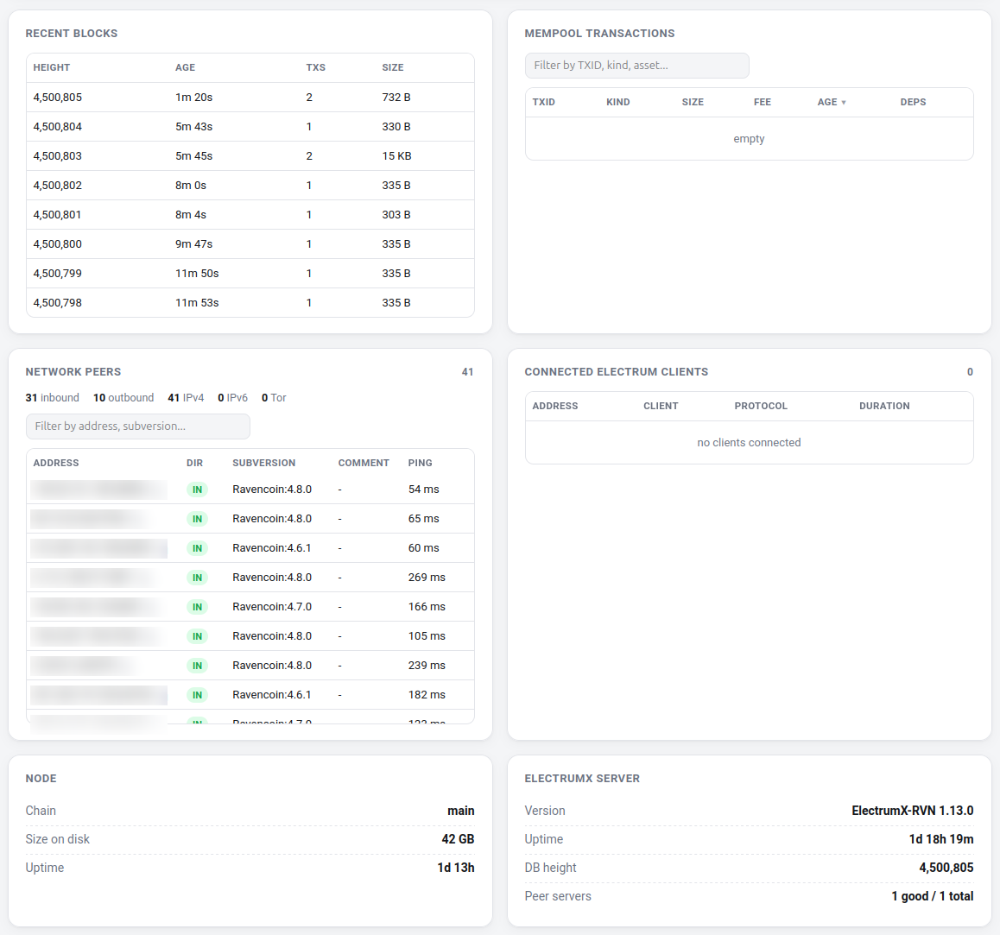
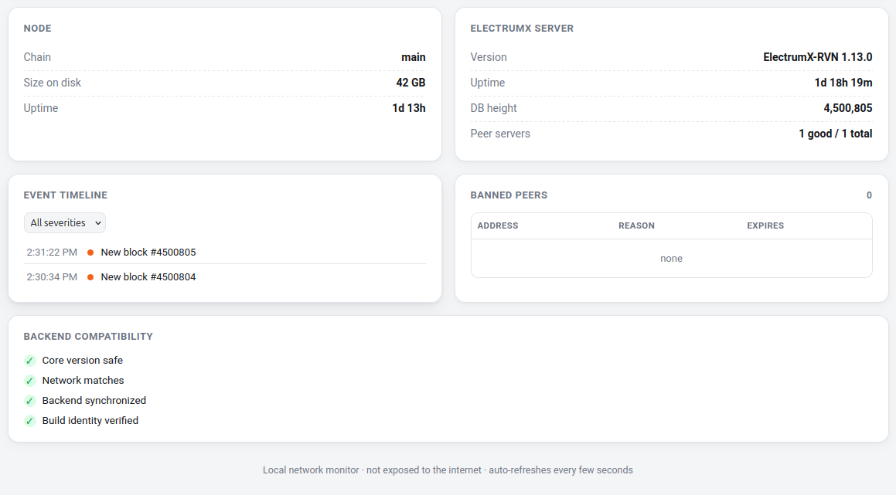

# Ravencoin Node Monitor

A lightweight, self-hosted monitoring dashboard for **Ravencoin Core**, with optional **ElectrumX** monitoring and optional host-side controls for upload bandwidth and connection limits.

It is intended for the machine that actually runs your node: Raspberry Pi, Orange Pi, mini PC, home server, VPS, or any Linux host with Docker.

> **In one sentence:** connect the monitor to your Ravencoin Core RPC and it gives you a browser dashboard for node health, synchronization, peers, mempool, disks, host resources, Ravencoin P2P traffic, ElectrumX, history and diagnostics; with the optional host controller you can also manage upload caps and peer/client limits without modifying Ravencoin Core or ElectrumX source code.

## Live public demo

**[Open the public demo → ravencoin-node-monitor.vercel.app](https://ravencoin-node-monitor.vercel.app/)**

The public demo is intentionally isolated from any private node. It uses public Ravencoin/mainnet and RVN/USDT data where possible, while node-only information is clearly marked as simulated or unavailable. See [`DEMO.md`](DEMO.md) for the exact boundary.

---

## Dashboard screenshots

The dashboard is responsive: cards rearrange automatically for desktop, tablet and mobile widths.

### Health, sync, resources and Ravencoin P2P traffic


### Bandwidth control, connection limits and history


### Blocks, mempool, peers and ElectrumX clients



### Node, ElectrumX, events and compatibility



> **Privacy note:** screenshots containing peer/client addresses should be captured with `PRIVACY_MODE=true` or manually redacted before publication. The monitor can mask addresses server-side.

---

# What the monitor does

The monitor reads information from **your own Ravencoin Core node** and, when configured, **your own ElectrumX server**. It does not replace either service and it does not participate in consensus.

The dashboard can show:

- Ravencoin Core version, chain, block height, headers and synchronization progress;
- RPC reachability and latency;
- a deterministic node-health score;
- connected Ravencoin P2P peers;
- inbound/outbound, IPv4/IPv6/Tor counts;
- peer subversions and ping times;
- network difficulty and estimated hashrate;
- mempool count, size, minimum fee and transaction information;
- recent blocks;
- host CPU load, temperature, RAM and swap;
- filesystem usage and additional blockchain disks;
- Ravencoin P2P download/upload rates and cumulative traffic from Core `getnettotals`;
- RAM-backed historical charts and storage-growth estimates;
- an event timeline for new blocks, outages, recoveries, reorgs, low-peer states and warnings;
- optional RVN/USDT market price;
- ElectrumX version, uptime, DB height, peer-server status and connected Electrum clients;
- backend compatibility checks;
- Prometheus-compatible metrics;
- health/readiness probes;
- a sanitized diagnostics endpoint.

With the **optional host controller**, the dashboard can additionally:

- limit Ravencoin Core public upload bandwidth;
- limit ElectrumX public upload bandwidth;
- set Ravencoin Core's maximum P2P connections using native `-maxconnections=N`;
- set ElectrumX's maximum client sessions using native `MAX_SESSIONS=N`.

No Ravencoin Core or ElectrumX source-code patch is required.

---

# Quick start

This section is deliberately written so that a first-time user can follow it without knowing the internals of the project.

## What you need

Before installing the monitor, you need:

1. a running Ravencoin Core node;
2. Core RPC enabled (`server=1`);
3. Docker with Docker Compose;
4. the RPC credentials for that Core node;
5. optionally, a running ElectrumX server.

ElectrumX is not mandatory. With `ELECTRUMX_ENABLED=auto`, ElectrumX-specific information is used only when available.

## 1. Install Docker

On Debian, Ubuntu or Raspberry Pi OS:

```bash
curl -fsSL https://get.docker.com | sh
sudo usermod -aG docker "$USER"
```

Log out and back in, or run:

```bash
newgrp docker
```

Verify:

```bash
docker compose version
```

## 2. Clone the repository

```bash
git clone https://github.com/ALENOC/ravencoin-node-monitor.git
cd ravencoin-node-monitor
```

## 3. Create the local configuration

```bash
cp .env.example .env
nano .env
```

At minimum, configure Core RPC:

```ini
CORE_RPC_HOST=YOUR_CORE_HOST
CORE_RPC_PORT=8766
CORE_RPC_USER=YOUR_RPC_USER
CORE_RPC_PASSWORD=YOUR_RPC_PASSWORD
```

### The important part: `CORE_RPC_HOST`

A frequent Docker mistake is assuming `127.0.0.1` means the Linux host. Inside the monitor container, `127.0.0.1` means **the monitor container itself**.

Use:

- the Core service/container hostname when both containers share a Docker network;
- an address reachable from Docker when Core runs directly on the host;
- the LAN IP/hostname when Core runs on another machine.

Configure Core `rpcbind` / `rpcallowip` narrowly. **Do not expose Ravencoin RPC to the public internet.**

A minimal Core RPC configuration is conceptually:

```ini
server=1
rpcuser=monitor_rpc
rpcpassword=USE_A_LONG_RANDOM_PASSWORD
```

If you use `rpcauth=`, the monitor still needs the original plaintext password associated with that generated credential; the stored hash itself is not the password sent by the RPC client.

## 4. Protect the dashboard

HTTP Basic authentication is optional for read-only monitoring but **required for write-capable controls**.

In `.env`:

```ini
MONITOR_USER=monitor
MONITOR_PASSWORD=CHOOSE_A_STRONG_PASSWORD
```

Never commit your real `.env` file.

If you access the dashboard through a DNS hostname, add it to `MONITOR_ALLOWED_HOSTS` as appropriate.

## 5. Start the monitor

```bash
docker compose up -d --build
```

Check the service:

```bash
docker compose ps
curl -s http://127.0.0.1:8899/healthz
```

Expected health response:

```json
{"status":"ok"}
```

That proves the monitor process is alive. The dashboard then tells you whether Core and ElectrumX are reachable and synchronized.

## 6. Open the dashboard

The default Compose configuration binds conservatively to:

```text
127.0.0.1:8899
```

Use localhost, an SSH tunnel, a deliberate LAN-specific override, or your own authenticated reverse proxy/firewall setup.

**Do not expose the dashboard or Ravencoin RPC directly to the internet without an appropriate security design.**

---

# How to read the main cards

## Health

The large health score is calculated from actual monitor state. It considers chain freshness/synchronization, RPC availability and latency, peers, storage, mempool access and ElectrumX lag when ElectrumX is enabled.

`100 HEALTHY` means the configured monitor checks are currently passing. It is not a guarantee about the security of the entire Ravencoin network.

## RVN / USDT

Optional market information from a public price feed. Enable it with:

```ini
PRICE_FEED_ENABLED=true
```

Price data is not required for node monitoring.

## Sync

Shows validated block height, headers and verification progress from Ravencoin Core.

During initial blockchain synchronization it is normal for headers to be ahead of fully validated blocks.

## P2P Network

Shows the Ravencoin node's live P2P state: connected peers, protocol version, difficulty and network hashrate information.

## Mempool

Shows the mempool seen by **your node**. Different nodes can temporarily have slightly different mempool views.

## Host Resources and Storage

Shows Linux/container-visible CPU load, temperature, memory, swap and disks. Additional blockchain disks can be exposed read-only to the monitor using the documented volume configuration and `EXTRA_DISK_PATHS`.

---

# Ravencoin Network Traffic

The **Ravencoin Network Traffic** card comes from Ravencoin Core's own:

```text
getnettotals
```

It represents this node's **Ravencoin P2P traffic**, not total host traffic.

It can show:

- current P2P download rate;
- current P2P upload rate;
- bytes received since Core started;
- bytes sent since Core started;
- total exchanged;
- the sampling window;
- Core's native upload-target status when applicable.

SSH, system updates, unrelated Docker traffic and the web dashboard itself are not part of Core's `getnettotals` counters.

The Core `Current P2P upload` shown in **Bandwidth Control** uses the same monitor sample as the Ravencoin Network Traffic card, so those two displayed values are intentionally aligned.

---

# Bandwidth Control

Bandwidth control is optional and uses a separate, root-owned host helper based on Linux `tc`.

The dashboard container remains unprivileged: it does **not** receive the Docker socket and does **not** receive `CAP_NET_ADMIN`.

Supported input units are:

```text
B/s
KB/s
MB/s
GB/s
```

`KB`, `MB` and `GB` are 1024-based in this project.

Examples:

```text
250 KB/s
1.5 MB/s
10 MB/s
```

`0` or **Unlimited** means no monitor-imposed bandwidth cap.

For Ravencoin Core, the displayed current upload is application-level P2P traffic from `getnettotals`. For ElectrumX, which has no equivalent application counter, current public egress is measured by Linux `tc`.

The actual cap is enforced at network level by `tc`. Private Docker/LAN destinations are exempted by the controller so Core ↔ ElectrumX local traffic is not intentionally throttled.

Full details: [`BANDWIDTH_CONTROL.md`](BANDWIDTH_CONTROL.md).

---

# Connection Limits

The two connection controls manage different things.

## Ravencoin Core · P2P peers

These are other Ravencoin nodes connected directly to Core.

Native option:

```text
-maxconnections=N
```

With no explicit override, the Ravencoin Core native default shown by the monitor is **125 peers**.

## ElectrumX · client sessions

These are Electrum-protocol wallets/clients connected to ElectrumX. They are **not** Ravencoin Core P2P peers.

Native setting:

```text
MAX_SESSIONS=N
```

The ElectrumX native default is **1000 sessions**, subject to ElectrumX's own file-descriptor safety logic.

## Meaning of the fields

- **Connected now** — live number of current connections.
- **Current limit** — the active/deployment/native limit reported by the monitor.
- **New limit** — the value you want to apply.

**`0` does not mean zero connections.** It means remove the monitor override and return to the deployment/native configuration.

Changing a connection limit requires recreating/restarting **only the selected service**, because Core and ElectrumX read these native settings at process startup. The dashboard asks for confirmation before applying the change.

Full details: [`CONNECTION_CONTROL.md`](CONNECTION_CONTROL.md).

---

# Optional host controller

Install this only if you want Bandwidth Control and Connection Limits to be writable from the dashboard.

## Host packages

On Debian/Ubuntu/Raspberry Pi OS:

```bash
sudo apt-get update
sudo apt-get install -y python3 iproute2 util-linux
```

## Install the systemd unit

Example when the repository lives at `/opt/ravencoin-node-monitor`:

```bash
cd /opt/ravencoin-node-monitor
sudo cp contrib/ravencoin-bandwidth-controller.service.example \
  /etc/systemd/system/ravencoin-bandwidth-controller.service
sudo systemctl daemon-reload
sudo systemctl enable --now ravencoin-bandwidth-controller.service
sudo systemctl status --no-pager ravencoin-bandwidth-controller.service
```

If your Core/ElectrumX container names differ from the defaults, edit the corresponding `Environment=` entries in the systemd unit.

Controller state is stored under:

```text
/var/lib/ravencoin-bandwidth/
```

The restricted control socket is:

```text
/run/ravencoin-bandwidth/control.sock
```

## Enable it in the monitor

In `.env`:

```ini
MONITOR_USER=monitor
MONITOR_PASSWORD=YOUR_STRONG_PASSWORD
BANDWIDTH_CONTROL_ENABLED=true
BANDWIDTH_CONTROL_SOCKET=/run/ravencoin-bandwidth/control.sock
```

Include the optional Compose overlay, for example:

```bash
docker compose \
  -f docker-compose.yml \
  -f docker-compose.override.yml \
  -f docker-compose.bandwidth.yml \
  up -d --build --no-deps monitor
```

Or configure your local `.env` with the appropriate `COMPOSE_FILE` list.

Do **not** overwrite an existing local `docker-compose.override.yml` blindly: preserve your own networks, volumes, bind addresses, secrets and user/group settings.

## Verify the socket

On the host:

```bash
sudo ls -l /run/ravencoin-bandwidth/control.sock
```

Inside the monitor container:

```bash
docker exec ravencoin-node-monitor \
  ls -l /run/ravencoin-bandwidth/control.sock
```

If the host socket exists but an already-running monitor container cannot see it, recreate **only the monitor**:

```bash
docker compose up -d --no-deps --force-recreate monitor
```

Do not restart Core or ElectrumX just to refresh this bind mount.

---

# ElectrumX integration

The simplest setting is:

```ini
ELECTRUMX_ENABLED=auto
```

Useful connection settings include:

```ini
ELECTRUMX_RPC_HOST=127.0.0.1
ELECTRUMX_RPC_PORT=8000
ELECTRUMX_SSL_HOST=127.0.0.1
ELECTRUMX_SSL_PORT=50002
```

Many ElectrumX deployments keep the admin RPC bound only to loopback inside the ElectrumX container. The project includes a host-side poller for that case so the monitor does not need the Docker socket and the admin RPC does not need to be opened to the LAN.

See the configuration examples and `.env.example` for the exact setup.

---

# History and flash wear

The recommended/default history mode is RAM-backed:

```ini
HISTORY_STORAGE=memory
```

Historical samples disappear when the monitor restarts, but this avoids continuous time-series writes to microSD cards and small SSDs.

If you explicitly want persistent SQLite history:

```ini
HISTORY_STORAGE=sqlite
HISTORY_DB_PATH=/data/history.db
```

and mount an appropriate writable `/data` volume.

For long-term external monitoring, use the `/metrics` endpoint with a Prometheus-compatible collector.

---

# Privacy

Enable:

```ini
PRIVACY_MODE=true
```

Peer/client IP addresses are then masked **server-side before they are sent to the browser**.

Example:

```text
192.168.1.123  ->  192.168.x.x
```

Privacy mode is not access control. A masked dashboard can still expose operational information, so do not use IP masking as a substitute for authentication/firewalling.

---

# Security model

The default monitor container is intentionally restricted:

- read-only root filesystem;
- `cap_drop: ALL`;
- `no-new-privileges`;
- no Docker socket;
- no `CAP_NET_ADMIN`;
- optional Basic authentication;
- Host-header validation;
- security headers and nonce-based CSP;
- support for RPC credentials from mounted files/Docker secrets;
- sanitized diagnostics built from an explicit safe-field set;
- certificate verification for remote/FQDN ElectrumX TLS targets;
- authentication and same-origin protection for write operations.

The privileged host controller is deliberately separated from the web application because Docker service recreation and Linux traffic shaping require host privileges.

`/healthz` and `/readyz` remain suitable for health probes even when dashboard authentication is enabled.

See [`SECURITY.md`](SECURITY.md).

---

# Useful endpoints

```text
GET /healthz
GET /readyz
GET /metrics
GET /api/status
GET /api/health
GET /api/events
GET /api/history
GET /api/diagnostics
GET /api/bandwidth
GET /api/connections
```

`/api/diagnostics` is intended for troubleshooting and excludes RPC passwords, webhook URLs and other known secrets.

---

# Updating an installation

Update the Git checkout, rebuild the monitor image, then recreate **only the monitor**:

```bash
cd /path/to/ravencoin-node-monitor
git pull --ff-only origin main
docker compose build monitor
docker compose up -d --no-deps --force-recreate monitor
```

Verify:

```bash
curl -s http://127.0.0.1:8899/healthz
```

Do not delete local `.env` or a local `docker-compose.override.yml` just to update the repository.

---

# Troubleshooting

## Dashboard opens but Core data is missing

```bash
docker compose logs --tail=100 monitor
```

Check that:

- RPC user/password are correct;
- `CORE_RPC_HOST` is reachable from inside the monitor container;
- Core has `server=1`;
- `rpcbind` / `rpcallowip` permit only the intended monitor address/network;
- you did not use container `127.0.0.1` when you actually meant the Docker host.

## Health works but browser asks for a password

Expected when `MONITOR_PASSWORD` is set. Health/readiness probes remain available separately.

## Bandwidth or connection controls say the host controller is unavailable

```bash
sudo systemctl status --no-pager ravencoin-bandwidth-controller.service
sudo ls -l /run/ravencoin-bandwidth/control.sock
docker exec ravencoin-node-monitor \
  ls -l /run/ravencoin-bandwidth/control.sock
```

## Connection limit shows 125 or 1000

Those are the native defaults shown when no monitor override is active:

- Ravencoin Core: **125 P2P peers**;
- ElectrumX: **1000 client sessions**, subject to its own file-descriptor logic.

`0` in **New limit** means remove the monitor override, not allow zero connections.

---

# Development and tests

Run the test suite:

```bash
python3 -m unittest discover -t . -s tests -p "test_*.py"
```

CI validates Python, dashboard JavaScript, tests, Docker build/smoke tests and the public demo configuration.

---

# Documentation

- [`BANDWIDTH_CONTROL.md`](BANDWIDTH_CONTROL.md) — upload shaping and host-controller security model
- [`CONNECTION_CONTROL.md`](CONNECTION_CONTROL.md) — Core peer and ElectrumX client-session limits
- [`DEMO.md`](DEMO.md) — public Vercel demo boundary
- [`SECURITY.md`](SECURITY.md) — security policy
- [`.env.example`](.env.example) — complete environment-variable reference

---

# License

MIT — see [`LICENSE`](LICENSE).

The Ravencoin icon used by the dashboard comes from the official RavenProject/Ravencoin repository and is covered by that project's MIT license.
