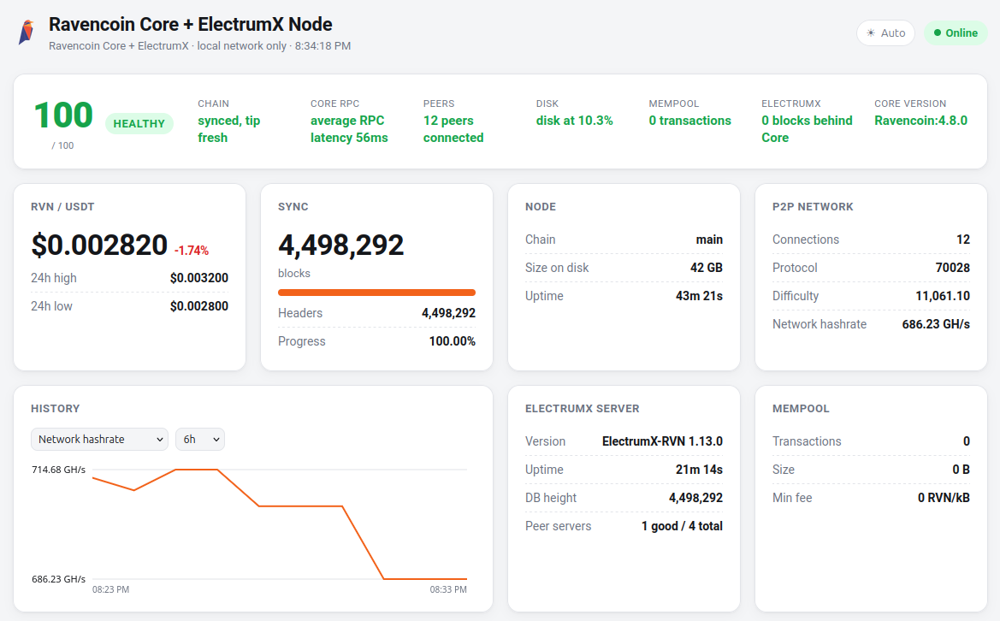
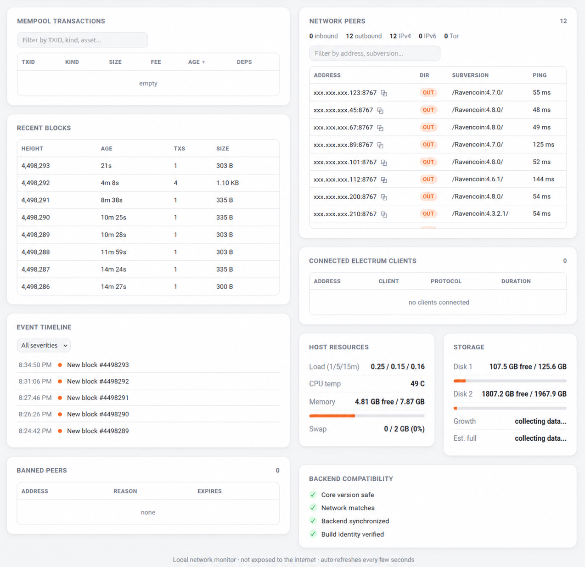

# ravencoin-node-monitor

A lightweight Ravencoin Core node health, security, and diagnostics
monitor, optionally paired with ElectrumX. One adaptive UI: it shows
Core-only metrics for a standalone node, and automatically adds ElectrumX
server / connected-client cards when ElectrumX is reachable.

Stdlib-only Python (no pip dependencies), a single static HTML page, and a
Docker image that runs on anything from a Raspberry Pi to a VPS.

## Screenshots





## Features

**Monitoring**
- Sync status, network hashrate, P2P peers (with addresses), mempool stats
  and transaction list (with RVN vs. asset-transfer classification), host
  resource usage (load, memory, swap, disk, CPU temperature)
- Click a mempool transaction for full detail: inputs, and every output's
  address, type, and RVN or asset amount; click a recent block to see its
  full transaction list
- Sortable and filterable peer/mempool tables, copy-to-clipboard on
  addresses and TXIDs, manual light/dark/auto theme toggle
- Reports disk usage for extra mounted volumes (e.g. blockchain data on a
  separate drive from the OS), not just the root filesystem
- A dedicated "node is starting up" state (instead of a wall of RPC
  errors) while Core is loading its block index after a restart
- Optional RVN/USDT price ticker (Binance public API)
- Optional ElectrumX section: server info and a live list of connected
  Electrum clients with their addresses

**Health, diagnostics & operations**
- A deterministic Node Health score (0-100) derived from chain state, RPC
  reachability, peer count, disk usage, mempool, and ElectrumX lag
- Chain integrity monitor: stale-tip detection, reorg detection, headers
  vs. validated-blocks lag, alternate chain tips (`getchaintips`)
- Core version safety check against an optional configured minimum,
  entirely offline - no internet access is ever made mandatory
- An internal event system (new block, Core down/recovered, reorg, disk
  warning/critical, ElectrumX down/recovered/behind, peer count low, Core
  restart detected, ...) that fires only on real state transitions, never
  once per poll cycle, with a browsable timeline in the UI
- Lightweight in-RAM history (see "History storage" below) with small
  built-in charts (no charting library) and a disk-usage growth/runway
  estimate
- Peer intelligence: inbound/outbound, IPv4/IPv6/Tor counts, subversion
  distribution - no external GeoIP lookups
- Richer Ravencoin asset classification: issuance, reissue, transfer,
  qualifier, sub-qualifier, restricted, unique, and ownership-token assets
  distinguished where Core's own RPC output makes it possible to do so
  reliably (reported as `unknown` rather than guessed otherwise)
- Optional generic webhook alerting on event state transitions, with a
  cooldown so a flapping condition can't spam it
- `/healthz`, `/readyz`, and an optional `/metrics` (Prometheus text
  format, hand-rolled - no client library) for external monitoring
- Optional `PRIVACY_MODE` masks IP addresses server-side, before they ever
  reach the browser
- A sanitized `/api/diagnostics` export for bug reports - never includes
  RPC credentials, webhook URLs, or other secrets

Zero third-party Python packages, one JSON `/api/status` endpoint plus a
handful of small focused endpoints, auto-refreshing page.

## Quick start

```bash
cp .env.example .env
# edit .env: set CORE_RPC_USER / CORE_RPC_PASSWORD (or the _FILE variants)
# to match your Ravencoin Core node's rpcauth
docker compose up -d --build
```

Open `http://<host>:8899` from your LAN. The container binds
`127.0.0.1:8899` by default in `docker-compose.yml` - it is meant to be
reached over the LAN via your own reverse proxy, SSH tunnel, or a firewall
rule you control. **It has no authentication of its own; do not expose it
to the public internet.**

## Configuration

All configuration is via environment variables - see `.env.example` for the
full list with defaults. Highlights:

| Variable | Purpose |
|---|---|
| `CORE_RPC_HOST` / `CORE_RPC_PORT` | Where to reach Ravencoin Core's JSON-RPC |
| `CORE_RPC_USER` / `CORE_RPC_PASSWORD` | RPC credentials (or the `_FILE` variants below) |
| `CORE_RPC_USER_FILE` / `CORE_RPC_PASSWORD_FILE` | Read credentials from a file instead (Docker secrets, mounted files) |
| `ELECTRUMX_ENABLED` | `auto` (default, silent probe), `true`, or `false` |
| `ELECTRUMX_RPC_HOST` / `_PORT` | ElectrumX's admin RPC (`rpc://`), default port 8000 |
| `ELECTRUMX_SSL_HOST` / `_PORT` / `_SNI` | ElectrumX's public `ssl://` port, used read-only for backend sync info |
| `PRICE_FEED_ENABLED` | Off by default; set `true` to poll Binance for RVN/USDT |
| `EXTRA_DISK_PATHS` | `Label=/path,Label2=/path2` - report disk usage for extra mounted volumes beyond `/` |
| `HISTORY_ENABLED` / `HISTORY_STORAGE` | History on by default, RAM-only (`memory`) by default - see "History storage" |
| `PRIVACY_MODE` | Mask IPs server-side (`192.168.1.123` -> `192.168.x.x`) before they reach the browser |
| `PROMETHEUS_ENABLED` | Expose `/metrics` in Prometheus text format (on by default) |
| `MIN_SAFE_CORE_VERSION` | e.g. `4.8.0` - flag the running Core version against a minimum, offline, no effect if unset |
| `ALERT_WEBHOOK_URL` | Generic webhook (unset by default) - see "Alerting" |

See `.env.example` for the full list, including health-threshold tuning
(`DISK_WARNING_PERCENT`, `ELECTRUMX_CRITICAL_LAG`, `CHAIN_STALE_WARNING_SECONDS`,
`HEALTH_MIN_PEERS`, `RPC_LATENCY_WARNING_MS`, ...) - every threshold has a
sane default; none of this needs to be touched to get a working monitor.

Credentials can be supplied either as plain environment variables or as
file paths (`*_FILE`), so you can mount Docker/Compose secrets instead of
putting passwords in `.env`.

## Deployment modes

### Standalone Ravencoin Core

The common case: point `CORE_RPC_HOST`/`CORE_RPC_PORT`/credentials at your
node. `ELECTRUMX_ENABLED=auto` (the default) means the ElectrumX section
just won't appear if nothing answers on the ElectrumX ports - no
configuration needed to hide it.

### Core + ElectrumX bundle

ElectrumX's admin RPC port (`rpc://`) is meant to be reachable from
*localhost only* by default - that's what makes `electrumx_rpc getinfo`
work without a password, so most ElectrumX deployments (including the
official `docker-compose` examples) bind it to `127.0.0.1` inside the
ElectrumX container itself. A sibling container on the same Docker network
cannot reach it, even by container name - and if your ElectrumX stack is
someone else's project (or already security-reviewed and you don't want
to touch its config), that binding should stay exactly as it is.

Three ways to get the connected-client list anyway, in order of
preference:

**1. Host-side poller (recommended - no ElectrumX config changes, no
Docker socket in the monitor container).** `contrib/electrumx-admin-poller.py`
runs on the Docker host itself (which already has legitimate `docker exec`
access to your own containers), polls the admin RPC via `docker exec`, and
writes a small JSON snapshot to disk. The monitor container just reads
that file read-only:

```bash
python3 contrib/electrumx-admin-poller.py \
  --container <your-electrumx-container-name> \
  --output /var/lib/ravencoin-node-monitor/electrumx-admin.json
```

(see `contrib/electrumx-admin-poller.service.example` for a systemd unit),
then in `.env`:

```
ELECTRUMX_ADMIN_SOURCE=file
ELECTRUMX_ADMIN_FILE=/data/electrumx-admin.json
```

and bind-mount the snapshot file read-only into the monitor container at
that path.

**2. Shared network namespace.** If you're fine editing your own compose
file, run the monitor with `network_mode: "container:<electrumx-container-name>"`
(see `docker-compose.electrumx.example.yml`) - `127.0.0.1:8000` inside the
monitor then reaches ElectrumX's admin RPC directly. Note this also means
the monitor's own HTTP port can only be published by adding it to the
ElectrumX service's own `ports:` list, since a container sharing another's
netns can't publish ports independently.

**3. Loosen the bind on purpose.** If you control the ElectrumX deployment
and are fine with it, changing `rpc://127.0.0.1:8000` to `rpc://0.0.0.0:8000`
in its `SERVICES` setting lets any sibling container on the same Docker
network reach it directly via `ELECTRUMX_RPC_HOST=<service-name>` - the
port still isn't published to the LAN unless you also add it to `ports:`.

If your ElectrumX deployment already binds its admin RPC to a routable
address, none of this is needed - just point `ELECTRUMX_RPC_HOST` at the
container/service name directly.

## Mempool transaction classification

Each mempool transaction is looked up via `getrawtransaction` (batched into
a single JSON-RPC call) and marked `RVN` or `ASSET: <name>` based on
whether any output carries an asset transfer. This only sees transactions
currently in Core's own mempool - it is not a general asset explorer, and
it does not require `txindex=1`.

## Transaction and block detail

`GET /api/tx/<txid>` fetches full detail for one transaction on demand
(size, version, locktime, inputs, and every output's address/type/amount)
- it is not part of the periodic `/api/status` snapshot, so a large mempool
doesn't bloat every poll cycle. The UI calls it when you click a mempool
transaction row. Input amounts aren't resolved (that would need one extra
RPC call per input to look up the spent output), only what's directly on
the raw transaction is shown.

`GET /api/block/<hash>` fetches one block's header fields and its list of
TXIDs - the UI calls it when you click a row in the Recent Blocks card.
Clicking a TXID inside that list then calls `/api/tx/<txid>?blockhash=<hash>`,
which passes the blockhash straight to `getrawtransaction`. Whether that
actually resolves a confirmed, already-spent transaction depends on your
node: newer Core RPC versions accept the blockhash hint directly; if yours
doesn't (this call silently falls back to a plain 2-argument call), or your
node doesn't run `-txindex=1`, a spent confirmed transaction will 404. This
is a real limitation of the node's RPC surface, not something the monitor
works around - unspent and mempool transactions always resolve fine either
way.

## Node Health

`/api/health` (and the panel at the top of the dashboard) exposes a
deterministic 0-100 score plus a `healthy` / `warning` / `critical` /
`unknown` status, computed server-side from fixed, documented rules - not
an arbitrary UI-only calculation:

| Component | Warning | Critical |
|---|---|---|
| Chain | tip stale > `CHAIN_STALE_WARNING_SECONDS`, or headers running ahead of validated blocks | tip stale > `CHAIN_STALE_CRITICAL_SECONDS` |
| Core RPC | average latency > `RPC_LATENCY_WARNING_MS` | Core unreachable (score forced to 0) |
| Peers | fewer than `HEALTH_MIN_PEERS` | zero peers |
| Disk | usage > `DISK_WARNING_PERCENT` (worst of root + any extra disk) | usage > `DISK_CRITICAL_PERCENT` |
| ElectrumX | lag >= `ELECTRUMX_WARNING_LAG` blocks, or unreachable while `ELECTRUMX_ENABLED=true` | lag >= `ELECTRUMX_CRITICAL_LAG` blocks |
| Mempool | data partially unavailable | - (informational only) |

A reorg is reported as a transient warning on the chain component and as
a `reorg_detected` event, never silently absorbed into the score. Core's
`-28 RPC_IN_WARMUP` state (loading the block index right after a restart)
is reported as `unknown`, not `critical` - it isn't a fault.

## Event system

Events fire only on state *transitions* (Core going down, then recovering;
disk crossing into warning, then back out; a reorg; a new block) - never
once per poll cycle, so a persistently unhealthy condition doesn't spam
the timeline. `GET /api/events?severity=warning&limit=100` (severity is
optional, `info`/`warning`/`critical`; results are newest-first, capped at
500 regardless of the requested limit).

## History storage

**History is RAM-only by default and does not survive a restart - this is
intentional.** The typical deployment target for this project is a
Raspberry Pi or similar SBC running off a microSD card, eMMC, or a small
SSD; writing a time-series sample to flash every poll cycle, forever,
is exactly the kind of write amplification that shortens the life of that
storage. Under the default configuration this project makes **zero**
periodic writes to persistent storage:

- History lives in SQLite's `:memory:` mode (`HISTORY_STORAGE=memory`) -
  genuine SQL range/bucketing queries power the charts and disk-runway
  estimate, but the data only ever exists in the process's own RAM.
- The event timeline is a bounded in-memory list (`EVENT_HISTORY_MAX`,
  default 2000 events).
- Two independent bounds keep memory predictable regardless of uptime: a
  retention window (`HISTORY_RETENTION_HOURS`, default 168 = 7 days) and a
  hard per-metric row cap (`HISTORY_MAX_SAMPLES`, default 20160) that
  applies even if the retention sweep ever falls behind.
- History samples are decoupled from the poll interval
  (`HISTORY_SAMPLE_INTERVAL`, default 60s) - the dashboard itself can keep
  polling Core every few seconds without that cadence also controlling how
  fast history grows.

At the defaults (17 tracked metrics, 60s sampling, 7-day retention) this
is roughly 1,000 rows/hour, ~170,000 rows at steady state, on the order of
**15-20MB of RAM** including the event log - genuinely lightweight.

Restarting the monitor (or its container, or the host) resets history to
empty; the dashboard handles this gracefully ("Collecting historical
data..." until enough samples exist) rather than erroring.

If you specifically want history to survive restarts and accept the write
wear, opt in explicitly:

```
HISTORY_STORAGE=sqlite
HISTORY_DB_PATH=/data/history.db
```

This never happens silently in either direction - `memory` never falls
back to writing a file, and `sqlite` never silently reverts to memory-only
if its path is misconfigured (it fails to start instead). If you want
long-term history without local writes at all, use the `/metrics`
endpoint with an external Prometheus-compatible collector instead of
asking this process to accumulate months of samples on its own.

## Alerting

Set `ALERT_WEBHOOK_URL` to receive a POST on every event whose severity is
at or above `ALERT_MIN_SEVERITY` (default `warning`), with at least
`ALERT_COOLDOWN_SECONDS` (default 900) between repeats of the same event
type - a flapping condition can't spam the endpoint. Delivery runs off the
poll loop's thread and never affects monitoring even if the webhook is
slow, unreachable, or misconfigured; failures are never logged (the URL
itself may carry a secret token). Payload:

```json
{"service": "ravencoin-node-monitor", "severity": "critical",
 "event": "core_unreachable", "message": "...", "timestamp": "..."}
```

## Operational endpoints

| Endpoint | Purpose |
|---|---|
| `GET /healthz` | Process liveness - is the poll loop thread running |
| `GET /readyz` | Is Core reachable and past warmup (suitable for a Docker `HEALTHCHECK` or an orchestrator readiness probe) |
| `GET /metrics` | Prometheus text exposition format (disable with `PROMETHEUS_ENABLED=false`); no peer IPs or other identifying strings are ever put in a label |
| `GET /api/health` | The Node Health object described above |
| `GET /api/events` | Recent events, `?severity=` and `?limit=` (capped at 500) |
| `GET /api/history` | `?metric=<name>&range=1h\|6h\|24h\|7d\|30d` - `metric` is checked against a fixed whitelist, never arbitrary |
| `GET /api/diagnostics` | Sanitized bug-report bundle - see below |

## Diagnostics export

`GET /api/diagnostics` returns a JSON bundle suitable for attaching to a
bug report: app/Core version, chain and health state, a config summary,
peer aggregates, storage/resource status, ElectrumX status, and the last
50 events. It is built from an explicit field whitelist, not by dumping
config or internal state, specifically so a future config field can never
leak into it by accident. It never includes RPC credentials, the alert
webhook URL (only whether one is configured), or, when `PRIVACY_MODE` is
on, unmasked IPs.

## Privacy mode

`PRIVACY_MODE=true` masks IPv4 (`192.168.1.123` -> `192.168.x.x`) and IPv6
(`2001:db8::1` -> `2001:db8:x:x:x:x`) addresses in peer lists, banned-peer
entries, and ElectrumX client sessions. Masking happens **server-side**,
before the snapshot is ever serialized to JSON - a raw address is never
sent to the browser in the first place, so there's nothing for the
frontend to accidentally leak. `.onion` addresses are left as-is (they
aren't real, geolocatable IPs to begin with).

## Updating a running deployment

If you're running via `docker compose` and only copy new source files into
the container's filesystem (`docker cp`) without rebuilding the image, the
change is temporary: the next time the container is recreated for *any*
reason - a reboot, `docker compose up -d` after touching `.env` or a
compose file, a Docker upgrade - Compose recreates it from the last-built
**image**, silently reverting to the old code. Always rebuild before
recreating:

```bash
docker compose build
docker compose up -d
```

The source tree on disk is the source of truth; the image should always be
rebuilt from it, never hand-patched and left that way.

## Running without Docker

```bash
cd app
python3 server.py
```

No dependencies beyond Python 3.9+.

## Docker hardening

The default `docker-compose.yml` runs the container with `read_only: true`,
`cap_drop: [ALL]`, and `no-new-privileges` - genuine hardening rather than
cosmetic, made possible by history being RAM-only by default (nothing on
disk needs to be writable under normal operation). If you opt into
`HISTORY_STORAGE=sqlite`, mount a volume at `/data` (see the commented
example in `docker-compose.yml`) - the rest of the container stays
read-only.

## Development

```bash
python3 -m unittest discover -t . -s tests -p "test_*.py"
```

Tests run against a programmable fake Ravencoin Core JSON-RPC responder
(`tests/fake_rpc.py`) - no live node is required, and none of the tests
make real network calls. CI (`.github/workflows/ci.yml`) runs this suite
plus `ruff` and a Docker build/smoke test on every push.

## License

MIT - see `LICENSE`.

`app/static/raven-icon.png` is the raven icon from the official
[RavenProject/Ravencoin](https://github.com/RavenProject/Ravencoin/tree/master/share/pixmaps)
repository, covered by that project's own MIT license.
